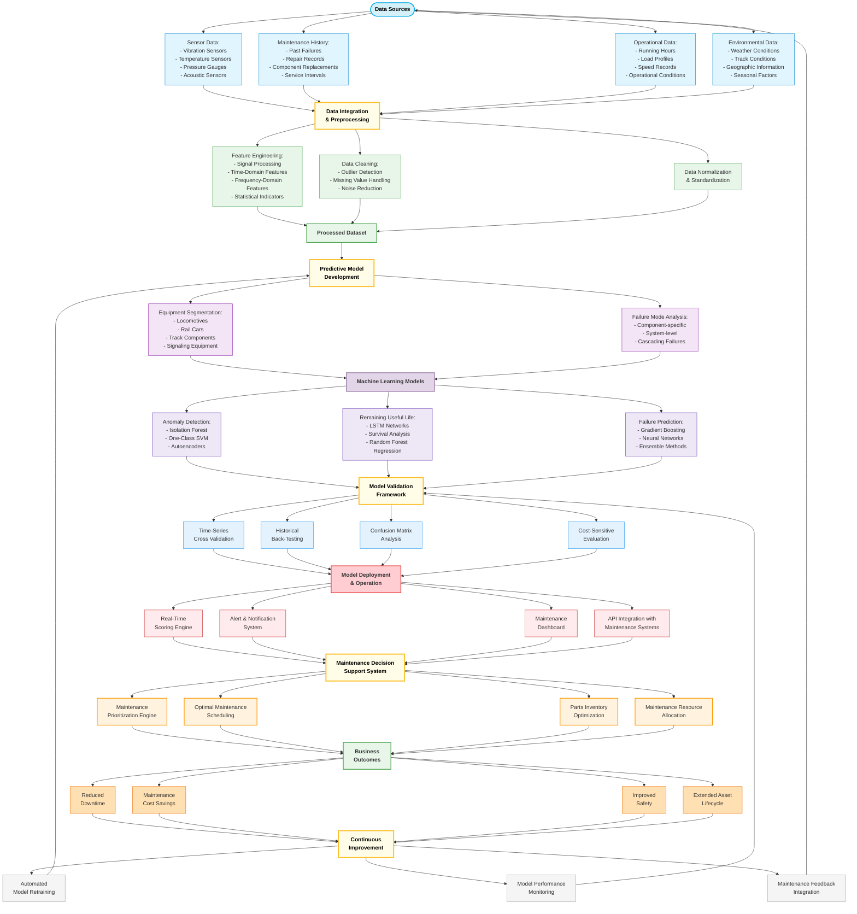

# Predictive-Maintenance
Railway Predictive Maintenance System

```mermaid
flowchart TD
    %% Main Data Sources
    DataSources([Data Sources]):::inputNode
    
    %% Data Source Breakdown
    DataSources --> SensorData["Sensor Data:<br/>- Vibration Sensors<br/>- Temperature Sensors<br/>- Pressure Gauges<br/>- Acoustic Sensors"]:::dataNode
    DataSources --> MaintenanceHistory["Maintenance History:<br/>- Past Failures<br/>- Repair Records<br/>- Component Replacements<br/>- Service Intervals"]:::dataNode
    DataSources --> OperationalData["Operational Data:<br/>- Running Hours<br/>- Load Profiles<br/>- Speed Records<br/>- Operational Conditions"]:::dataNode
    DataSources --> EnvironmentalData["Environmental Data:<br/>- Weather Conditions<br/>- Track Conditions<br/>- Geographic Information<br/>- Seasonal Factors"]:::dataNode
    
    %% Data Integration & Preprocessing
    DataIntegration["Data Integration<br/>& Preprocessing"]:::processNode
    
    SensorData --> DataIntegration
    MaintenanceHistory --> DataIntegration
    OperationalData --> DataIntegration
    EnvironmentalData --> DataIntegration
    
    DataIntegration --> FeatureEngineering["Feature Engineering:<br/>- Signal Processing<br/>- Time-Domain Features<br/>- Frequency-Domain Features<br/>- Statistical Indicators"]:::prepNode
    DataIntegration --> Cleaning["Data Cleaning:<br/>- Outlier Detection<br/>- Missing Value Handling<br/>- Noise Reduction"]:::prepNode
    DataIntegration --> Normalization["Data Normalization<br/>& Standardization"]:::prepNode
    
    FeatureEngineering --> ProcessedData["Processed Dataset"]:::resultNode
    Cleaning --> ProcessedData
    Normalization --> ProcessedData
    
    %% Model Development
    ModelDev["Predictive Model<br/>Development"]:::processNode
    
    ProcessedData --> ModelDev
    
    ModelDev --> Segmentation["Equipment Segmentation:<br/>- Locomotives<br/>- Rail Cars<br/>- Track Components<br/>- Signaling Equipment"]:::modelNode
    ModelDev --> FailureModes["Failure Mode Analysis:<br/>- Component-specific<br/>- System-level<br/>- Cascading Failures"]:::modelNode
    
    Segmentation --> MLModels["Machine Learning Models"]:::mlNode
    FailureModes --> MLModels
    
    MLModels --> AnomalyDetection["Anomaly Detection:<br/>- Isolation Forest<br/>- One-Class SVM<br/>- Autoencoders"]:::methodNode
    MLModels --> RemainingLifetime["Remaining Useful Life:<br/>- LSTM Networks<br/>- Survival Analysis<br/>- Random Forest Regression"]:::methodNode
    MLModels --> FailurePrediction["Failure Prediction:<br/>- Gradient Boosting<br/>- Neural Networks<br/>- Ensemble Methods"]:::methodNode
    
    %% Validation Framework
    ValidationFrame["Model Validation<br/>Framework"]:::processNode
    
    AnomalyDetection --> ValidationFrame
    RemainingLifetime --> ValidationFrame
    FailurePrediction --> ValidationFrame
    
    ValidationFrame --> CrossValidation["Time-Series<br/>Cross Validation"]:::validationNode
    ValidationFrame --> BackTesting["Historical<br/>Back-Testing"]:::validationNode
    ValidationFrame --> ConfusionMatrix["Confusion Matrix<br/>Analysis"]:::validationNode
    ValidationFrame --> CostFunction["Cost-Sensitive<br/>Evaluation"]:::validationNode
    
    %% Deployment & Operation
    Deployment["Model Deployment<br/>& Operation"]:::deployNode
    
    CrossValidation --> Deployment
    BackTesting --> Deployment
    ConfusionMatrix --> Deployment
    CostFunction --> Deployment
    
    Deployment --> RealTimeScoring["Real-Time<br/>Scoring Engine"]:::systemNode
    Deployment --> AlertSystem["Alert & Notification<br/>System"]:::systemNode
    Deployment --> Visualization["Maintenance<br/>Dashboard"]:::systemNode
    Deployment --> APIIntegration["API Integration with<br/>Maintenance Systems"]:::systemNode
    
    %% Decision Support System
    DecisionSupport["Maintenance Decision<br/>Support System"]:::processNode
    
    RealTimeScoring --> DecisionSupport
    AlertSystem --> DecisionSupport
    Visualization --> DecisionSupport
    APIIntegration --> DecisionSupport
    
    DecisionSupport --> PrioritizationEngine["Maintenance<br/>Prioritization Engine"]:::outputNode
    DecisionSupport --> OptimalScheduling["Optimal Maintenance<br/>Scheduling"]:::outputNode
    DecisionSupport --> PartInventory["Parts Inventory<br/>Optimization"]:::outputNode
    DecisionSupport --> ResourceAllocation["Maintenance Resource<br/>Allocation"]:::outputNode
    
    %% Business Outcomes
    BusinessOutcomes["Business<br/>Outcomes"]:::resultNode
    
    PrioritizationEngine --> BusinessOutcomes
    OptimalScheduling --> BusinessOutcomes
    PartInventory --> BusinessOutcomes
    ResourceAllocation --> BusinessOutcomes
    
    BusinessOutcomes --> ReducedDowntime["Reduced<br/>Downtime"]:::outcomeNode
    BusinessOutcomes --> CostSavings["Maintenance<br/>Cost Savings"]:::outcomeNode
    BusinessOutcomes --> SafetyImprovement["Improved<br/>Safety"]:::outcomeNode
    BusinessOutcomes --> AssetLifeExtension["Extended Asset<br/>Lifecycle"]:::outcomeNode
    
    %% Continuous Improvement
    ContinuousImprovement["Continuous<br/>Improvement"]:::processNode
    
    ReducedDowntime --> ContinuousImprovement
    CostSavings --> ContinuousImprovement
    SafetyImprovement --> ContinuousImprovement
    AssetLifeExtension --> ContinuousImprovement
    
    ContinuousImprovement --> ModelRetraining["Automated<br/>Model Retraining"]:::feedbackNode
    ContinuousImprovement --> PerformanceMonitoring["Model Performance<br/>Monitoring"]:::feedbackNode
    ContinuousImprovement --> FeedbackLoop["Maintenance Feedback<br/>Integration"]:::feedbackNode
    
    ModelRetraining --> ModelDev
    PerformanceMonitoring --> ValidationFrame
    FeedbackLoop --> DataSources
    
    %% Styling
    classDef inputNode fill:#d4f1f9,stroke:#05a8e6,stroke-width:2px,color:black,font-weight:bold
    classDef dataNode fill:#e1f5fe,stroke:#0288d1,stroke-width:1px
    classDef processNode fill:#fffde7,stroke:#fbc02d,stroke-width:3px,color:black,font-weight:bold
    classDef prepNode fill:#e8f5e9,stroke:#43a047,stroke-width:1px
    classDef resultNode fill:#e8f5e9,stroke:#43a047,stroke-width:2px,font-weight:bold
    classDef modelNode fill:#f3e5f5,stroke:#8e24aa,stroke-width:1px
    classDef mlNode fill:#e1d5e7,stroke:#9673a6,stroke-width:2px,font-weight:bold
    classDef methodNode fill:#ede7f6,stroke:#673ab7,stroke-width:1px
    classDef validationNode fill:#e3f2fd,stroke:#2196f3,stroke-width:1px
    classDef deployNode fill:#ffcdd2,stroke:#e53935,stroke-width:2px,font-weight:bold
    classDef systemNode fill:#ffebee,stroke:#c62828,stroke-width:1px
    classDef outputNode fill:#fff3e0,stroke:#ff9800,stroke-width:2px
    classDef outcomeNode fill:#ffe0b2,stroke:#ef6c00,stroke-width:1px
    classDef feedbackNode fill:#f5f5f5,stroke:#9e9e9e,stroke-width:1px
```
